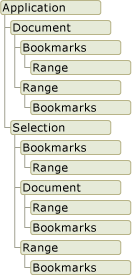

# 行波管测试报告自动生成研究  

<!-- TOC -->

- [摘要](#摘要)
- [Abstract](#abstract)
- [第一章 绪论](#第一章-绪论)
  - [1.1 课题研究背景](#11-课题研究背景)
  - [1.2 课题研究目的与意义](#12-课题研究目的与意义)
  - [1.3 国内外发展状况](#13-国内外发展状况)
  - [1.4 本章小结](#14-本章小结)
- [第二章 相关技术分析](#第二章-相关技术分析)
  - [2.1 VSTO](#21-vsto)
    - [2.1.1 VSTO简介](#211-vsto简介)
    - [2.1.2 Word对象模型](#212-word对象模型)
  - [2.2 OpenXml](#22-openxml)
  - [2.3 MySQL数据库技术](#23-mysql数据库技术)
  - [2.4 本章小结](#24-本章小结)
- [第三章](#第三章)
- [第四章](#第四章)
- [第五章 总结与展望](#第五章-总结与展望)
- [参考文献](#参考文献)

<!-- /TOC -->

## 摘要  

## Abstract  

## 第一章 绪论  

### 1.1 课题研究背景  

### 1.2 课题研究目的与意义  

### 1.3 国内外发展状况  

### 1.4 本章小结  

## 第二章 相关技术分析  

### 2.1 VSTO  

#### 2.1.1 VSTO简介  

Visual Studio Tools for Office (VSTO)是一套包括Visual Studio add_in项目模板和允许MS Office 2003及更新版本的Office应用作为 .Net Framework Common Language Runtime(CLR)的宿主的运行时的开发工具，通过这套开发工具可以通过.NET运行环境拓展Office的功能。VSTO允许使用CLI兼容语言及Office应用提供的功能和用户接口编写Office应用拓展程序。  

在Visual Studio中可以获取帮助创建VSTO外接程序所需的工具。外接程序项目包含一个表示VSTO外接程序的自动生成的类。此类提供的属性和事件可用于访问主机应用程序的对象模型并在加载和关闭VSTO外接程序时运行代码。VSTO外接程序项目中还提供许多其他Visual Studio功能，例如Windows窗体和集成的调试器。通过使用Visual Studio中的Office开发人员工具生成VSTO外接程序时，将创建由Microsoft Office应用程序加载的托管的代码程序集。加载该程序集后，VSTO外接程序可以响应在MS Office中发生的事件。VSTO外接程序也可以通过主互操作程序集(Primary Interop Assembly, PIA)调用MS Office的对象模型，以便实现应用程序自动化和扩展应用程序，也可以使用 .NET Framework中的任何类来拓展需要的功能。  

当用户启动MS Office应用程序时，该应用程序使用部署清单和应用程序清单来查找并加载VSTO外接程序程序集的最新版本。下图显示了VSTO外接程序的基本体系结构。  
  

#### 2.1.2 Word对象模型  

Word提供了数百个可通过PIA与之交互的对象。这些对象严格遵循用户界面的层次结构。Application对象位于层次结构的顶部，此对象表示Word的当前实例。Application对象可以包含Document、Selection、Bookmark和Range对象。上述每个对象均具有很多属性和可用于操作对象和与之进行交互的方法。  

下图显示了Word对象模型层次结构中这些对象的一个视图。  
  

1. 应用程序对象(Application)  
由于Word是一个单例应用只存在一个进程，而Application对象表示Word应用程序是所有其他对象的父级，其成员通常作为一个整体应用于Word。可以使用其属性和方法来控制Word环境。在VSTO外接程序项目中，可以通过Application类的Application字段来访问ThisAddIn对象。  
2. 文档对象(Document)  
Document对象是Word编程的中心。它表示一个文档及其所有内容。当你打开文档或创建新文档时，将创建新的Document对象，并将其添加到Microsoft.Office.Interop.Word.Documents对象的Application集合。具有焦点的文档被称为活动文档。它由ActiveDocument对象的Application属性表示。
Visual Studio中的Office开发工具通过提供Document类型来扩展Document对象。此类型是一个托管项，使你可以访问Document对象的所有功能，并增添了其他事件以及添加托管控件的能力。  
3. Selection 对象  
Selection对象表示当前所选的区域。在Word用户界面中执行操作(如文本加粗)时，可以选择或突出显示文本，然后应用格式设置。文档中始终存在Selection对象。如果未选中任何内容，则它表示插入点。此外，选定内容可包含多个不相邻的文本块。  
4. Range对象  

除Word对象模型以外，通过Visual Studio还可访问可扩展Word对象模型中的一些对象的托管项和托管控件。主机项和主机控件的行为类似于它们扩展的Word对象，但它们还具有其他功能(如数据绑定功能)和额外事件。

### 2.2 OpenXml  

### 2.3 MySQL数据库技术  

### 2.4 本章小结  

## 第三章  

## 第四章  

## 第五章 总结与展望  

## 参考文献  

[1]VSTO开发者指南[M]. 机械工业出版社 , (美) 麦克格拉斯 (McGrath, 2008  
[2]龚冠. 基于VSTO技术的公司报表系统的设计与应用[D].天津大学,2017.  
