# 行波管测试报告自动生成研究  

<!-- TOC -->

- [摘要](#摘要)
- [Abstract](#abstract)
- [第一章 绪论](#第一章-绪论)
  - [1.1 课题研究背景及意义](#11-课题研究背景及意义)
  - [1.2 国内外发展状况](#12-国内外发展状况)
  - [1.3 课题研究目的](#13-课题研究目的)
  - [1.4 论文的组织结构](#14-论文的组织结构)
- [第二章 相关技术研究](#第二章-相关技术研究)
  - [2.1 VSTO](#21-vsto)
    - [2.1.1 VSTO简介](#211-vsto简介)
    - [2.1.2 Word对象模型](#212-word对象模型)
  - [2.2 Open XML](#22-open-xml)
  - [2.3 MySQL数据库技术](#23-mysql数据库技术)
  - [2.4 本章小结](#24-本章小结)
- [第三章 报告系统设计](#第三章-报告系统设计)
  - [3.1 系统总体设计](#31-系统总体设计)
  - [3.2 系统详细设计](#32-系统详细设计)
    - [3.2.1 系统基础模块](#321-系统基础模块)
    - [3.2.2 报告设计模块](#322-报告设计模块)
    - [3.2.3 报告生成模块](#323-报告生成模块)
    - [3.2.4 数据访问模块](#324-数据访问模块)
  - [3.3 系统数据库设计](#33-系统数据库设计)
  - [3.4 本章总结](#34-本章总结)
- [第四章 报告系统实现](#第四章-报告系统实现)
  - [4.1 开发语言及工具选择](#41-开发语言及工具选择)
  - [4.2 报告系统的具体实现](#42-报告系统的具体实现)
    - [4.2.1 系统基础模块](#421-系统基础模块)
    - [4.2.2 报告设计模块](#422-报告设计模块)
    - [4.2.3 报告生成模块](#423-报告生成模块)
    - [4.2.4 数据访问模块](#424-数据访问模块)
  - [4.3 本章小结](#43-本章小结)
- [第五章 总结与展望](#第五章-总结与展望)
  - [5.1 全文总结](#51-全文总结)
  - [5.2 工作展望](#52-工作展望)
- [参考文献](#参考文献)

<!-- /TOC -->

## 摘要  

## Abstract  

## 第一章 绪论  

### 1.1 课题研究背景及意义  

行波管作为一种微波大功率放大器件已在航海、雷达、电子对抗及卫星通信等技术领域中。在行波管研究与生产过程中，为了掌握研发进度和行波管质量，需要对行波管的各项特征参数进行多次测试以及时发现并解决问题。[1]在行波管交付阶段，用户为了验证行波管的性能指标也需要对行波管进行大量测试。但是，行波管各项特性参数非常多，测试过程十分繁琐且需要测试人员同时掌握多种微波测试仪器的规范使用方法及各种微波测量方法。并且，行波管特性参数的非常多，目前特性参数测量方法的测试过程复杂，测试时间长，测试效率低，怎么快速有效地解决目前测试行波管特性参数中存在的问题，一直成为行波管研制过程中急需克服的挑战之一[2]。  

目前计算机技术广泛发展推动了测试仪器的数字化进程，测试仪器趋向数字化、软件化。不同仪器间的标准规范化使得用软件控制测试仪器自动完成测试过程，记录测试数据并生成测试报表的自动化测试系统的实现成为了现实。行波管自动测试系统在测试不同的参数时无需改变硬件连接方式，在启动测试时只需在操作面板上设置少量必需参数即可开始测量过程，测试过程快速有效，极高的提高了测试效率。  

报表往往是展示行波管测试结果最直观的表现形式，通过一份格式化的报表可以在研发和生产部门间有效地传递当前行波管所处的状态。通过测试报表可以大幅减少不同部门间的沟通成本，提高生产、研发效率。同时一支行波管的所有报表也体现了该管在一段时间内性能发生的变化，对于以后解决可能出现的问题提供了数据支撑，也是在大量生产时判断该管型是否老练足够的依据。可见测试报表是对行波管的整体总结，在行波管测试过程中具有重要地位。  

测试报表是测试结果输出的重要途经和主要方式，在整个测试过程中属于数据整理环节。由于行波管测试参数非常多，加之每个参数的测试数据也非常多，在此环节引入人为误差的可能性非常大。为了减小测试过程中可能产生的人为误差，节约人力成本，提高行波管测试效率有必要实现报表生成的自动化。而在行波管测试中，每个研究机构或生产厂家在长期的发展过程中已经形成了一套相对固定的内部报表格式，虽然测试内容相对固定，但表现形式十分多样化。为了减少这些机构将测试系统转换为自动化测试系统的代价，自动化测试系统的报表生成模块有必要具有适应不同报表模板的能力。由此可见进行行波管测试报告自动生成的研究可以节约大量人力，加速测试流程，对于推动行波管测试的自动化进程，加速行波管的发展进程具有重要意义。  

### 1.2 国内外发展状况  

微波测量仪器发展至今主要经历了四个阶段：第一阶段为模拟仪器阶段，仪器为电磁机械式结构，通过机械指针显示测量值的刻度；第二阶段为数字仪器阶段，在仪器内部将模拟信号转化为数字信号，相比于模拟仪器具有测试准确度高，响应速度快的优点[3]；第三阶段为智能仪器阶段，智能仪器诞生于1970年，通过与计算机配合完成测试任务，其测试速度与精度有了突破性的提高，现已广泛运用于实际生产活动中；第四阶段为虚拟仪器阶段，在总线技术出现后开始大规模使用[4]，虚拟仪器包含了智能仪器、总线和网络，由软件和硬件两部分组成，现在常用的总线标准有：GPIB、PXI、VXI、LAN和LXI等[5]。虚拟仪器通过总线和网络实现软件与硬件间的通信，将测试数据打包传输使得数据管理和报表生成成为了可能，在实际使用中可以根据需要编写软件实现特定测试功能的自动化测试平台。  

国外在商业报表领域发展很深入，21世纪以前已广泛采用水晶报表为代表的C/S模式软件，20世纪80年代，微软公司在Visual Basic中集成了水晶报表使得水晶报表逐渐成为当时的行业标准。进入21世纪后随着互联网以及数据库技术的发展，报表软件逐渐向B/S模式转化，用户可以不用安装客户端在浏览器上即可访问报表系统，具体体现为数据中心化和终端轻量化。国内外学者已对企业报表工具进行了大量研究，主要有三个方面的改进思路：第一，在设计报表时“所见即所得”，减少用户在报表设计和预览时的差异提高用户体验；第二，在设计报表时通过向导模式给用户推荐元素提高元素的复用率；第三，采用中间格式的文件提高报表生成的效率，减少用户制作报表模板的重复劳动。[6]  

而测试报告有其自身的特殊性，为了适应生产和技术的发展，测试项目可能会有增加，测试报告的格式也可能会有多次微调，而为了数据的连续性要求新的报告模板能兼容旧报告的数据。与商业报表不同，分析某一型号的行波管时需要多年积累的测试报告，如果直接使用商业报表将造成数据存储混乱，报表格式不统一，需要制作大量报表模板等可以预见的问题。国内行波管研发在自动化测试方面还处于起步阶段，自动化测试系统还未普及，目前大多数机构还处于从传统手工测试向自动化测试转换的过程中。由于报表格式复杂加之测试仪器数字化程度低，在数据处理方面大多采用人工读取数据，以“填表”的方式生成测试报告。现有的自动化测试系统的报表生产环节多借助于实现自动化测试的虚拟化仪器平台，如LabView。通过虚拟化仪器平台提供的MS Office COM接口制作报表。而虚拟化仪器平台提供的接口使用过程繁琐且功能单一难以实现进一步的定制化功能。  

### 1.3 课题研究目的  

本文的主要研究内容有：  

研究了VSTO与Open XML SDK这两种可以通过编程方式修改Word文档的技术。根据实际需要，本文最终决定采用两者互相配合的方式完成报表生成的任务。  

介绍了MySQL数据库，研究了自动化测试数据在数据库中的存储方式并在此基础上研究了一种使得报表模板与测试数据可以在数据库中共存的方法。  

在以上研究的基础上，针对测试报告的特殊要求构建了一套可用于自动化测试系统的报告自动生成解决方案。  

### 1.4 论文的组织结构  

本文的结构安排如下：  

第一章简要地介绍了自动化测试系统及自动化测试过程中报告生成环节，给出了行波管测试报告自动生成课题的研究背景及意义、自动化测试系统中报告自动生成的国内外研究现状及本文的主要研究内容。  

第二章介绍了实现本报告自动生成系统采用主要技术。  

第三章介绍了本报告自动生成系统的设计方案。首先从介绍了系统的整体架构并介绍了本系统的主体功能，为各功能模块划分了作用边界。接下来介绍了系统中的主要功能模块，根据各自的功能需求及在整体架构中所属的层次给出了详细的设计方案。最后完成了数据库中关系表的设计。  

第四章介绍了基于.Net Framwork的报告生成系统的具体实现，首先介绍了开发环境及开发语言及开发过程中涉及到的其他技术工具，然后以第三章的设计方案作为蓝图完成了对本系统的编码，在此基础上依此详细介绍了系统中各模块的实现方式并给出了关键代码截图及软件运行截图。  

第五章总结了本课题设计的报告生成系统的完成情况、报告生成系统中存在的不足及改进方向。  

## 第二章 相关技术研究  

### 2.1 VSTO  

#### 2.1.1 VSTO简介  

Visual Studio Tools for Office (VSTO)是一套包括Visual Studio add_in项目模板和允许Microsoft(MS) Office 2003及更新版本的Office应用作为 .Net Framework Common Language Runtime(CLR)的宿主的运行时的开发工具，通过这套开发工具可以通过.NET运行环境拓展Office的功能。[7]VSTO允许使用CLI兼容语言及Office应用提供的功能和用户接口编写Office应用拓展程序。  

在Visual Studio中提供了VSTO外接程序项目的脚手架工程。外接程序项目中包含一个VSTO外接程序的类。通过此类提供的属性和事件可访问宿主应用程序的对象模型并在加载和关闭VSTO外接程序时运行代码。VSTO外接程序项目中还可使用许多其他Visual Studio功能，例如Windows窗体和集成的调试器。通过使用Visual Studio中的Office开发人员工具生成VSTO外接程序时，将创建由MS Office应用程序加载的托管代码程序集。加载该程序集后，VSTO外接程序可以响应在MS Office中发生的事件。VSTO外接程序也可以通过主互操作程序集(Primary Interop Assembly, PIA)调用MS Office的对象模型，以便实现应用程序自动化和扩展应用程序，也可以使用 .NET Framework中的任何类来拓展需要的功能。  

当用户启动MS Office应用程序时，该应用程序使用部署清单和应用程序清单来查找并加载VSTO外接程序程序集的最新版本。下图显示了VSTO外接程序的基本体系结构。[8]  
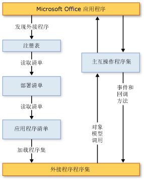  

#### 2.1.2 Word对象模型  

Word提供了数百个可通过PIA与之交互的对象，VSTO可以通过这些对象利用编程的方式实现Word的自动化。这些对象严格遵循用户界面的层次结构。Application对象位于层次结构的顶部，此对象表示Word的当前实例。Application对象可以包含Document、Selection、Bookmark和Range等对象。上述每个对象均具有很多属性和可用于操作对象和与之进行交互的方法。[9]  

下图展示了某个实体Word对象模型的层次结构视图。  
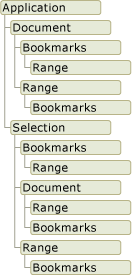  

下面简要介绍Word对象模型中的重要对象：  

- 1.应用程序对象(Application)  
由于Word是一个单例应用只存在一个进程，而Application对象表示Word应用程序是所有其他对象的父级，其成员通常作为一个整体应用于Word。可以使用其属性和方法来控制Word环境。在VSTO外接程序项目中，可以通过Application类的Application字段来访问ThisAddIn对象。  
- 2.文档对象(Document)  
Document对象表示一个文档及其所有内容。当打开文档或创建新文档时，将创建Document对象，并将其添加到Microsoft.Office.Interop.Word.Documents对象的Application集合。当前被选中的文档具有焦点被称为活动文档，可通过Application对象的ActiveDocument属性访问活动文档。
可通过VSTO提供的Document类型来扩展Document对象。此类型是一个托管项，通过该类型可以调用Document对象的所有功能，VSTO为该类型设计了其他事件并添加托管控件的能力。  
- 3.Selection 对象  
Selection对象表示当前被选中的区域。在Word中执行操作(如文本加粗)时，可以通过选择文本构建一个Selection对象，然后在此对象上应用格式设置。文档将始终存在Selection对象，如果未选中任何内容，则Selection对象表示插入点。此外，Selection对象包含的文本块可以互不相临。  
- 4.Range对象  
Range对象表示文档中的相邻区域，该对象通过起始字符位置和结束字符位置界定。可以在同一文档中同时定义多个Range对象。Range对象具有以下特性：  
  - 可以只包含单独的插入点，也可包含一个文本范围或整个文档。  
  - 可以包括非打印字符，如空格、制表符和段落标记。  
  - 可以基于当前选定内容创建，也可以通过其他方式创建。  
  - 在文档中不可见。  
  - 不随文档一起保存且仅存在于代码运行时。  
  - 当在某个范围的末尾插入文本时，Word 会自动扩展包含该处的所有Range对象，使其包含插入的文本。  
- 5.Bookmark对象  
Bookmark对象与Range对象相似通过具有起始位置和结束位置界定，表示文档中一段连续的内容。Bookmark对象具有与Range对象几乎完全相同的特性，在代码运行时可以将两者互相转化，不同的是Bookmark对象将随文档一起保存。  

除Word对象模型以外，通过Visual Studio还可访问VSTO扩展的Word对象模型中的一些托管项和托管控件。托管项和托管控件具备其扩展的Word对象的所有功能并且还包含其他功能(如数据绑定功能)和额外事件。  

### 2.2 Open XML  

Open XML(Ecma Office Open XML)是一种针对字处理文档、电子表格和演示文档的国际性ECMA 376第二版和ISO/IEC 29500标准文件格式规范。现已被业界广泛接受并采用，如MS Office、OpenOffice Novell Edition、开源项目Neo-Office和Gnumeric。[11]从技术的角度来看，Open XML是一种开源的打包约定的规范。Open XML文件格式是开放性标准并基于以下已知技术：ZIP和XML。Open XML作为一个统一标准的开发平台为开发人员使用代码方式访问并操作文档内容及格式提供了极大的方便，针对Open XML规范编写的代码可用于处理任意软件生成的Open XML文档。  

随着互联网的发展为了在服务器与客户机间传递数据，出现于二十世纪九十年代的可拓展标记语言XML使得人们认识到在一个统一的标准下开发软件具有重大意义。微软提出Open XML标准的主要目的是建立一个统一的文档标准，在此基础上统一各个互不兼容的二进制文档结构以便实现文档间的数据交换。作为开源标准Open XML不容易造成垄断，而占据当时文档处理市场的微软提出并率先采用该标准极大的推动了该标准的普及。微软自身也将MS Office处理的文档由二进制类型过度到Open XML标准并借此分离了由MS Office应用程序创建的文档，以便其他应用程序可以独立于专有格式操作这些文档而不会丢失数据。Open XML这一统一的标准沿用至今，现在仍是微软推荐的文档格式。  

Open XML文档使用ZIP技术进行打包和压缩。可以使用任意ZIP查看器来查看Open XML文档的结构。一个Open XML文档由多个部件构成。这些部件之间的关系也作为一个部件存储文档中。从结构上来讲，Open XML文档是开放打包约定(OPC)包。一个文档由一组文档部件组成。每个部件的部件名称由一个段序列或路径名称组成，如"/word/theme/theme1.xml"，文档中包含一个名为“[Content_Types].xml”的部件，通过该部件记录了文档中所有部件的内容类型。以“.rels”扩展名结尾的部件中包含源包与部件间的显式关系。[12]

Open XML SDK 2.5 for Office是微软官方发布的操作OpenXML标准文档的开发工具包，该工具包基于System.IO.Packaging API构建而成，并提供强类型类来处理符合Office Open XML文件格式规范的文档。该工具包将文档格式操作封装为多个类方便开发人员调用。通过该开发工具包，开发人员可以不用担心在操作文档的过程中造成文档格式的损坏从而专注于功能的实现。  

### 2.3 MySQL数据库技术  

### 2.4 本章小结  

## 第三章 报告系统设计  

现有的报告生成功能由自动化测试系统基于的LabView虚拟仪器平台提供，功能实现高度依赖于测试平台，可移植性差，且由于测试平台提供的功能有限难以实现较高程度的定制化。本章将针对现有报告生成的缺陷，设计独立于特定测试平台的报表生成系统。首先将介绍系统的总体架构，然后分别介绍系统的各功能模块。  

### 3.1 系统总体设计  

由于测试平台具有相对独立性，考虑到用户具有离线生成测试报告的需求，本系统决定采用传统的桌面应用形式开发并使用MVVM模型来确立功能边界。本系统的总体架构如[图3-1-1]所示，主要包括表现层、业务层、数据层及数据源等几个部分。各个部分的作用如下：  
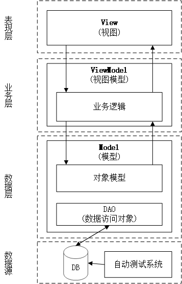  

1. 表现层  
表现层主要包含视图(View)，用于渲染UI。这一层的作用主要是提供可视化图形界面，实现用户交互。用户的任意操作会被View组件捕获并发送至业务层，在业务层处理完用户请求后View组件将业务层返回的结果通过呈现给用户。  
2. 业务层  
业务层中主要包含视图模型(ViewModel)，主要的业务逻辑也存放在视图模型中。业务逻辑表现的是某一功能的实现流程。整个业务层与数据无关，所需的数据全部需要通过数据层获得。业务层是连接表现层与数据层的桥梁，属于无状态组件。业务层不关心数据的来源，专注于对于特定数据结构的处理。  
3. 数据层  
数据层中主要包含对象模型和数据访问对象(DAO)，对象模型是系统中需要操作的对象实体，对象访问对象负责访问数据库获取数据并通过数据构造对象模型，同时将经过处理的数据保存到数据库中。  
4. 数据源  
数据源表示数据的来源，主要与数据访问对象相匹配为整个系统提供数据来源。本系统将数据库作为数据源，该数据源同时也是自动化测试系统中测试数据的存放数据库。

### 3.2 系统详细设计  

采用模块化设计可以使得系统进一步解耦，使得系统可以通过进行微调或者更换模块适应实际需求，也使得程序易于测试、维护。进行模块化设计可能在模块间通信时增加额外的开销，但考虑到模块化在拓展性及可维护性方面带来的巨大优势这些性能损失是可以接受的。综合实际需求及系统的拓展性，本系统采用模块化设计。  

#### 3.2.1 系统基础模块  

系统基础模块属于总体设计中数据层的对象模型部分。该模块的主要功能是：定义系统中使用的各种数据结构及对象。该模块的主要意义在于增强系统的可拓展性及降低模块间的耦合度。具体而言，由于在拓展系统功能时需要修改对象模型则仅需在该模块中添加对象所需的属性而不会影响原有模块的工作从而极大提高了系统的可拓展性；当现有模块不符合要求时新设计的模块仅需遵守该模块中的数据结构及函数签名便能替换原来的模块从而降低系统的耦合度。通过版本号递增的形式可以在系统上线后向系统中添加新的功能，由于高版本的系统将拥有更多的功能，故使用高版本基础模块的生成器将可以兼容低版本设计器设计的模板，反之则会造成异常。该模块是整个系统的基础，是系统中模块相互配合的桥梁。  

#### 3.2.2 报告设计模块  

报告设计模块是总体设计中的表现层及业务层的一部分，主要负责报告模板的设计工作，是与用户交互最多的模块，直接影响到用户的使用体验。本系统为提高用户体验，也为了满足各种定制化要求为该模块设计了UI，实现了模板制作的图形可视化。报告设计器以导航的形式悬浮于MS Word的旁边，通过一个树状图提供可供插入的数据种类，用户可以直接在树状图上点选所需的数据种类；提供多个按钮分别对应不同的插入功能满足用户对报告的定制化要求；最后提供一个列表显示用户的历史操作，方便用户查看、修改历史操作。通过导航栏的实现可以使得用户无需抛弃原有的报告制作环境，通过MS Word设计出需要的效果，刨除了以前报表制作过程中手工输入数据的环节，使得测试人员专注于报告格式与数据表的设计上。该模块的流程图如[图3-2-1]所示，序列图如[图3-2-2]所示。

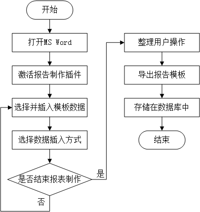  
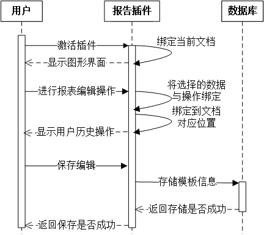

#### 3.2.3 报告生成模块  

报告生成模块是总体设计中业务层的另一部分，主要负责根据报告模板生成报告，需要嵌入到自动化测试系统中，是多次重复使用的模块。根据报表生成模块的特殊性，本系统将该模块设计为程序集(assemble)，以动态链接库(dll)的形式提供给自动化测试系统。该模块的主要功能是通过外部指定的数据来源和报告模板生成格式化的报告。由于采用动态链接库的形式提供，该模块可以直接嵌入现有的运行在Windows平台上的任意自动化测试系统中。根据客户的实际需要可在自动化测试系统的平台环境下基于该模块拓展图形界面完成更精细的报告生成操作，如根据测试数据汇出数据变化曲线。该模块在运行时被初始化为生成器，需要用户导入通过报告设计模块制作的报告模板，由于在模板中保留了系统版本信息，通过解析模板可以获取模板设计时使用的版本号，如果在设计时使用了高版本功能则无法通过低版本生成器生成报告，使用高版本生成器可以兼容低版本设计器设计的模板。在确认模板信息无误后生成器需要用户给定数据来源，通过数据来源导入数据再将数据与模板组合生成报告。该模块的流程图如[图3-2-3]所示，序列图如[图3-2-4]所示。  

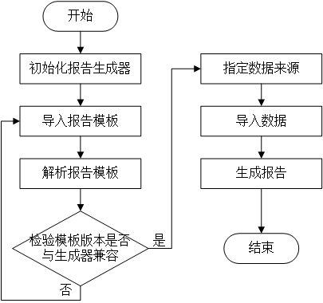  
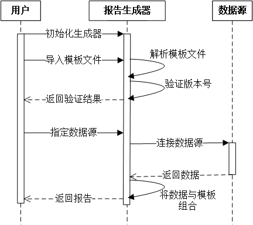  

#### 3.2.4 数据访问模块  

数据访问模块主要包括数据层中的数据访问对象，通过该模块向系统中输送数据并将需要存储的数据存储到数据源中。一个系统可以携带多个数据访问模块，数据访问模块与数据源相对应，定义了数据源中的数据与系统对象携带数据间的映射关系，根据用户的实际需要可以及时添加对应新的数据源的数据访问模块满足特定要求。考虑到数据库的通用性及安全性较高，本系统选择数据库作为数据源来构建数据库数据访问模块，其他数据访问模块则需要根据数据源重新设计。数据访问模块接受系统的请求向数据源发送请求，接收到数据库返回的数据后利用这些数据构造系统所需的对象或者将系统中对象携带的数据写入数据库中。  

### 3.3 系统数据库设计  

根据系统的要求，本系统需要在数据库中建立3张表以满足实际需求，这些数据表的结构、功能及表间关系如下各表所述：  

1.报告模板结构表  

[表3-1]是模板结构表，用于储存系统对象中数据的结构以建立数据间映射关系。该表将数据结构进行分解，将树状结构以关系表的形式进行存储。通过模板结构表可以在不访问系统的前提下构造出用于系统模块间通信的数据结构。其中StructID是主键。  
表3-1  

| 字段名称 | 数据类型 | Not Null | 字段说明 |
| :-: | :-: | :-: | :-: |
| StructID | Int | Yes | 主键、自增 |
| StructName | varchar(100) | Yes | 存储结构节点的名称 |
| StructParentID | Int | No | 存储结构节点父节点的ID |
| StructNodeType | varchar(100) | Yes | 表征该节点的功能 |

2.系统信息表  

[表3-2]是系统信息表，用于记录向数据库中写操作时文档设计器包含的用于设别操作的额外信息。该表主要用于区分用户设计的多个模板。其中InformationID是主键。  
表3-2  

| 字段名称 | 数据类型 | Not Null | 字段说明 |
| :-: | :-: | :-: | :-: |
| InformationID | Int | Yes | 主键、自增 |
| Version | varchar(100) | Yes | 本次设计器所使用的版本号 |
| Time | datetime | Yes | 记录进行存储的时间戳 |
| TemplatePath | varchar(100) | Yes | 记录报告文档模板存放的路径 |
| Notes | varchar(100) | No | 记录用于设别模板的额外信息 |

3.模板数据表  

[表3-3]是模板数据表，用于记录报告模板操作的所有信息。两个外键分别对应前面数据结构表及数据信息表中各自的主键，每条数据信息由系统信息及结构信息共同确认。  
表3-3  

| 字段名称 | 数据类型 | Not Null | 字段说明 |
| :-: | :-: | :-: | :-: |
| InformationID | Int | Yes | 外键 |
| StructID | Int | Yes | 外键 |
| Data | varchar(100) | Yes | 记录数据 |

以上通过主键、外键及字段说明简要介绍了数据库中的三张核心表，为了阐明三张表间的依赖关系，下面通过数据库模型图[图3-3-1]给出三张表表间的联系。  

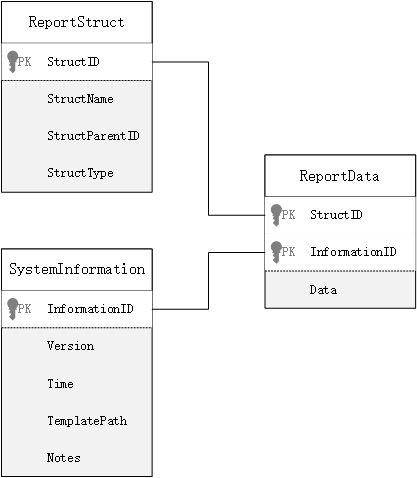  

### 3.4 本章总结  

本章自顶而下地介绍了本报告生成系统，重点介绍了报告系统的设计方案。首先通过划分功能边界将软件细分为四层，在此基础上给出了系统的架构图，简述了构成系统的基础模块、模板设计模块、报告生成模块及数据访问模块并展示了各模块间的关系。之后深入介绍了各功能模块。最后介绍了数据库设计方案并给出了数据库中的3张核心表。  

## 第四章 报告系统实现  

报告生成系统的设计工作已于第三章完成，本章将着重于介绍报告系统的实现方法，包括开发语言及环境的选择、开发工具的选择、数据库的构建等一系列具体的工作。下面将逐个介绍在各模块中如何使用各种工具构建本报告生成系统。

### 4.1 开发语言及工具选择  

本系统基于Windows下的.NET Framework运行环境实现。与之相对应，由于现有的自动化测试系统多构建于虚拟仪器平台上，而虚拟仪器平台又大多构建于Windows系统下且要求生成MS Word格式的报告，基于多方面考虑并对各语言进行比较。本系统选择C#语言，C#语言是由微软推出的一种面向对象的强类型语言，它诞生于2000年左右，最初可被看作Java语言的升级版，借助于微软在Windows方面的支持经过近20年的发展，C#语言在Windows下具有了得天独厚的开发优势，是微软指定的VSTO开发语言。C#语法简洁，代码结构清晰，易于理解。近年来为了推广C#，微软推出了.Net Core这一开源环境，选择C#语言将使得本系统在未来有着巨大的拓展前景。.Net Framework则是Windows必备的系统级运行环境，使用该运行环境可以减少用户在部署系统时可能遇到的环境配置问题。  

C#语言功能完备，可以很好的支持各种主流数据库包括本系统选用的MySQL数据库。本系统在数据库的实现上选用MySQL数据库，MySQL数据库可拓展性强，数据库功能齐全，能提供较快的存储与访问速度，MySQL是开源软件，可以自由使用。本系统使用SQL语言与MySQL数据库进行交互，使用SQL语言将降低系统与MySQL的耦合程度，方便以后针对定制化的要求更换数据库。MySQL针对SQL语句进行过优化，使用SQL访问数据库可以获得更好的用户体验。  

本系统的表现层选用了WPF来构建界面UI。Windows Presentation Foundation(WPF)是一套用于构建桌面应用程序界面的图形库，WPF包括可扩展应用程序标记语言 (XAML)、控件、数据绑定、布局、二维和三维图形、动画、样式、模板、文档、媒体、文本和版式等，WPF是.NET Framework的一部分，因此C#语言可以在.Net Framework运行环境下直接编写对应代码，使用该图形库构建界面UI。[15]

### 4.2 报告系统的具体实现  

本节将介绍如何使用上一节中选定的各种技术构建本系统的各个功能模块。

#### 4.2.1 系统基础模块  

系统基础模块主要用于定义数据结构并封装一些常用的操作函数供其他模块调用。在报告的模板设计、存储、生成阶段都需要导入系统基础模块，通过系统基础模块进行通信。由于系统基础模块定义了系统的数据结构与行为，故可以通过对该模块进行版本控制从而定义不同版本系统间的兼容性问题。  

系统基础模块主要代码如[图4-2-1]所示。  

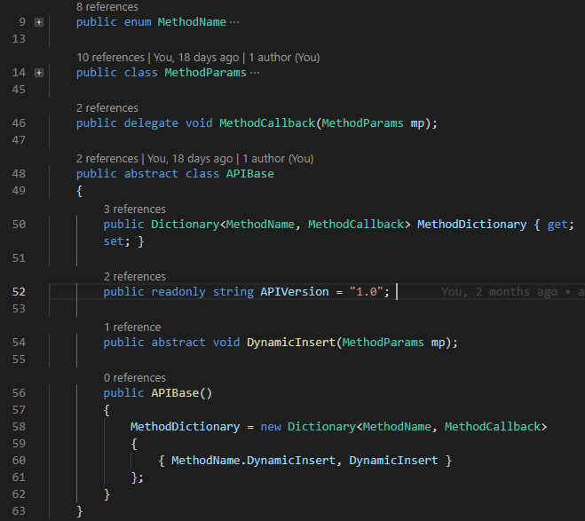  

如图所示，本文撰写时仅在系统中添加了用于演示的动态插入(DynamicInsert)功能，如需添加新的功能只需在该模块中添加所需功能的函数签名并在参数类中添加所需的属性即可在模板设计器及生成器中分别添加所需方法的实现而不会影响系统的运行。通过版本号的控制可明确地支持某个版本所支持的功能，模板设计器及生成器均需实现所携带基础模块版本号所对应的全部功能。

#### 4.2.2 报告设计模块  

报告设计模块是用于制作报告模板的模块，主要以可视化的形式将封装好的功能模块提供给用户使用。该模块在外观上类似MS Word自带的导航栏，使用VSTO封装的Office PIA对文档进行操作。界面UI使用WPF编写，WPF使用一种拓展标记语言XAML进行界面设计，这种代码构建方式也被称为声明式编程，通过界面设计声明元素再通过代码构建元素的行为及元素间的关系。  

本模块的部分界面UI代码如[图4-2-2]所示，在Word中加载该模块后的效果如[图4-2-3]所示。  

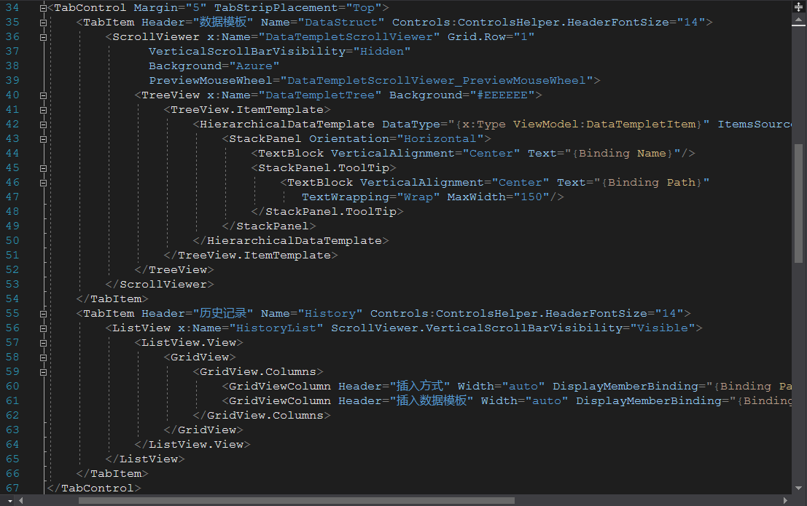  

由[图4-2-4]可见数据模板使用树状图的方式表示数据的结构，用户通过在树状图中选择所需的数据点击插入按钮即可在文档中光标所处位置设置插入该数据，完成一次设计操作。  

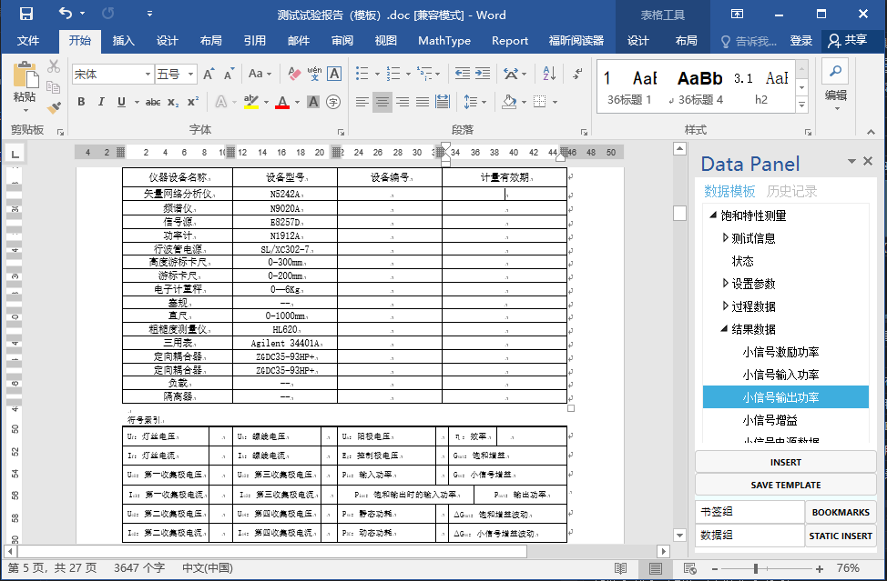  

设计操作间相互独立，在同一个位置可以多次进行设计操作，但可能会在表格中造成数据混乱故不推荐在使用本系统时在同一位置进行多次设计操作。每次设计操作将在系统中留下记录，记录将以列表的形式显示在历史记录选项卡中，如[图4-2-5]所示，用户可以通过历史记录查看自己进行过的操作。由于本系统暂不支持撤销操作，故不推荐用户在进行设计操作后使用撤销操作，这可能导致系统在生成报告时出现错误。  

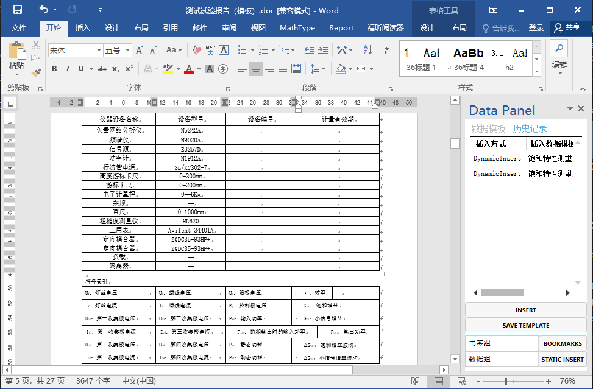  

报告设计模块是相对独立的模块，可以和生成器部署在不同的位置上。由于模块的相对独立性，设计器与生成器能在不同的物理机上协同工作，使得本系统具有了良好的实用性。该模块主要提供给制定报告具体格式的管理人员制作报告模板。  

#### 4.2.3 报告生成模块  

报告生成模块使用设计器制作的报告模板利用给定数据源中的数据生成报告。该模块将用于自动化测试中的报告自动化，为了配合现有的自动化测试系统，该模块采用数据集的方式实现，以动态链接库的形式提供给用户，用户可以在自动化测试系统中调用该动态链接库制作报告生成器。该模块依赖.Net Framework，也即用户的自动化测试系统若搭建在Windows操作系统上时则可直接引入该动态链接库，本文为演示该功能模块创建了一个控制台程序作为生成器的入口。生成器主要代码如[图4-2-5]所示。  

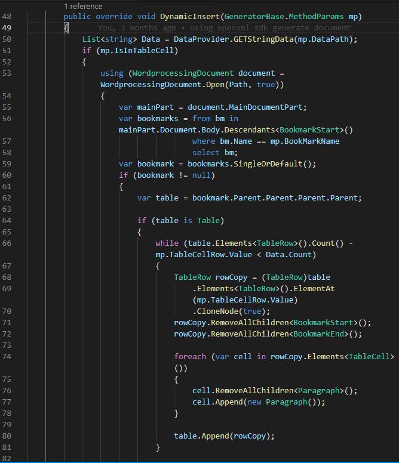  

#### 4.2.4 数据访问模块  

数据访问模块主要用于从数据源中取得数据并将报告模板中的内容上传到数据库中，对应数据访问模块需要遵守的函数签名与数据结构定义在系统基础模块中。本文将演示如何数据库中取得数据。报告模板从XML文件中读取，XML文件则由数据库结构表中读取数据的结构构造XML中的节点关系。获取数据时，根据用户提供的信息在系统信息表中确定数据的系统编号，再根据从数据模板中读取数据路径对应的数据库中的数据结构ID，最后从数据库数据表中中读取所需的数据。  

[图4-2-6]展示了数据访问模块的主要代码。

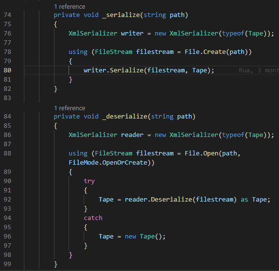  

### 4.3 本章小结  

本章主要介绍了报告生成系统的具体实现。首先介绍了系统的开发语言及环境，并介绍了开发系统过程中使用的各种辅助工具，然后按照功能模块分类介绍了模块的具体功能实现并给出了关键代码截图及设计器图形界面运行截图。  

## 第五章 总结与展望  

### 5.1 全文总结  

本课题深入探讨了自动化测试系统中报告生成环节中存在的一些问题，明确了实现报告生成自动化的重要作用，并在现有的行波管自动测试系统中根据饱和特性这一基本测试参数设计了一套基于.Net Framework的报告自动生成系统。该系统通过将模板制作与报告生成分离开实现了系统的泛用性及可拓展性，由于采用了可视化的方式设计了模板设计器，对比于现有的基于LabView的报告生成系统在制作报告模板的过程中更加人性化，数据来源与数据插入方式更加清晰。通过对现有的一套测试报告的测试证明了该设计器可以迅速地将现有的报告制作成为可以进行自动化测试的报告模板，在生成器对该模板进行处理后可以生成与人工手动制作报告十分相似的测试报告，基本上完成了该系统的设计目的。  

在行波管自动化测试系统中的测试表明本系统的生成模块生成的动态链接库可被虚拟仪器平台调用，自动化测试系统准确地识别出了生成模板提供的函数，经过简单的代码包装即可在现有的行波管自动化测试系统中构造报告自动生成器，用户仅需要提供数据源即可根据模板实现报告自动生成。在自动化测试结束后即可启动报告生成程序自动生成该次测试的测试报告。  

综上所述，本报告生成系统完全可以胜任测试报告的制作工作，实现自动化测试过程中的报告生成环节的自动化。本系统可以极大的减少自动化测试中报告制作环节中的人为干预，节约人力资源，对行波管的研制与生产效率的提高提供了极大的帮助。  

### 5.2 工作展望  

本文完成了一种基于.Net Framework的新型报告自动化生产系统，基本实现了设计目的。但该系统还存在着许多可以进行改进与优化的部分，主要有下面几项：

1. 仅仅在验证系统框架正确性的基础上实现了最简单的文字数据插入功能，虽然具有现有基于LabView虚拟仪器平台的报告自动生成生成功能的全部功能，但并不能体现出本系统的优越性也并不能完全替代手工的报告制作。后续考虑继续添加功能函数实现进一步的报告制作功能，彻底实现报告生成的自动化。
2. 本系统在测试时仅考虑到饱和特性这一单一特性参数，自动化测试过程中还有许多重要的参数需要生成报告，后续将继续拓展数据模板提供对行波管全特性参数的支持。
3. 本系统与数据库的配合还十分生硬，现阶段数据库仅作为数据的备份，所需的外部数据可通过中间文件格式单独提供，后续考虑进一步分析并调整系统实现系统直接与数据库通信而不用借助中间件文件格式。

## 参考文献  

[1]李仕峰. 基于Labwindows/CVI的行波管自动测试系统设计与实现[D].电子科技大学,2018.  
[2]李镇远,冯进军,梁友焕. 行波管中的微波测量技术[M].北京:国防工业出版社,2013,54.  
[3]陈宪琳. 基于Lab VIEW的内燃机空气滤清器试验系统[D].山东轻工业学院,2009.  
[4]张高俊. 基于虚拟仪器的远程路面结构性能测试系统的研究[D].长安大学,2010.  
[5]许征程. 简述虚拟网络实验室中的虚拟仪器[J].中国现代教育装备,2005(2):19-22.  
[6]钟子豪. 基于Web日志挖掘的报表系统设计与实现[D].华中科技大学,2016.  
[7]麦克格拉斯(McGrath). VSTO开发者指南[M].机械工业出版社,2008.  
[8]MicroSoft. Architecture of VSTO Add-ins[EB/OL].<https://docs.microsoft.com/en-us/visualstudio/vsto/architecture-of-vsto-add-ins?view=vs-2019>  
[9]MicroSoft. Word object model overview[EB/OL].<https://docs.microsoft.com/en-us/visualstudio/vsto/word-object-model-overview?view=vs-2019>  
[10]龚冠. 基于VSTO技术的公司报表系统的设计与应用[D].天津大学,2017.  
[11]程睿. 基于OpenXML的docx文档的创建和修改工具[D].大连理工大学,2013.  
[12]MicroSoft. About the Open XML SDK 2.5 for Office[EB/OL].<https://docs.microsoft.com/en-us/office/open-xml/about-the-open-xml-sdk>  
[15]MicroSoft. WPF overview[EB/OL].<https://docs.microsoft.com/en-us/visualstudio/designers/introduction-to-wpf?view=vs-2019>  
